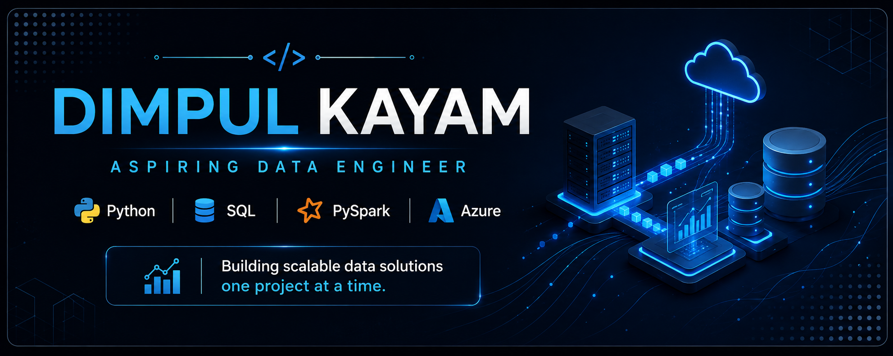

  

<h1 align="center">Hi 👋, I'm Dimpul Kayam</h1>

  

  <i>Transforming data into meaningful solutions, one project at a time.</i>

---

## 👨‍💻 About Me

I'm an aspiring **Data Engineer** with a passion for building efficient, scalable, and reliable data solutions.

My journey is focused on understanding how data flows through modern systems, from ingestion and transformation to analytics. I enjoy solving problems with code, learning new technologies, and applying them through hands-on projects.

Currently, I'm strengthening my skills in **Python, SQL, PySpark, Azure Databricks, and Azure Data Factory**, while building a GitHub portfolio that reflects my growth as a data engineer.

### 🎯 Current Goals

- 🚀 Build real-world Data Engineering projects
- 📊 Design scalable ETL and data pipelines
- ☁️ Learn cloud-based data engineering on Azure
- 🤝 Contribute to open-source projects
- 📚 Continuously improve through hands-on learning

 

---

---

# 🛠️ Tech Stack

### 👨‍💻 Programming Languages

  

### 🗄️ Database

  
  

### ⚡ Data Engineering

  
  
  

### 🛠️ Tools & IDEs

  

### 📊 Productivity

  

---
---

# 📊 GitHub Analytics

  
  

  

---

# 🏆 GitHub Trophies

  

---
